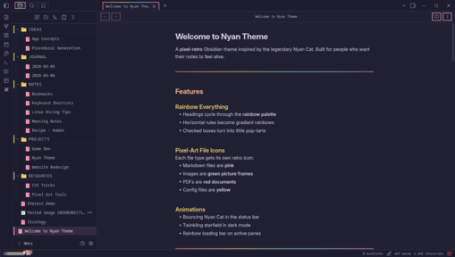
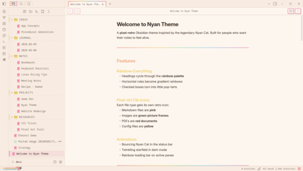
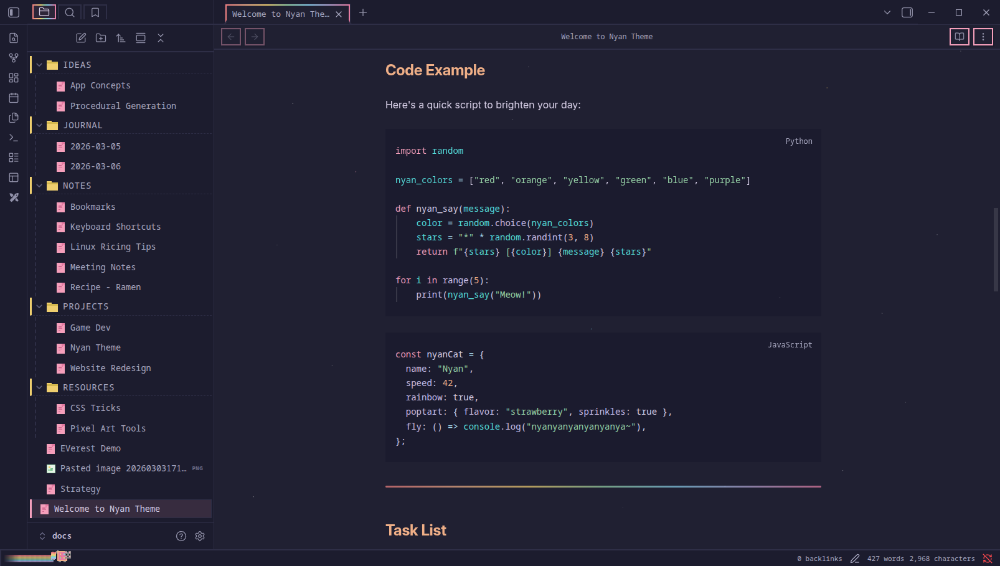
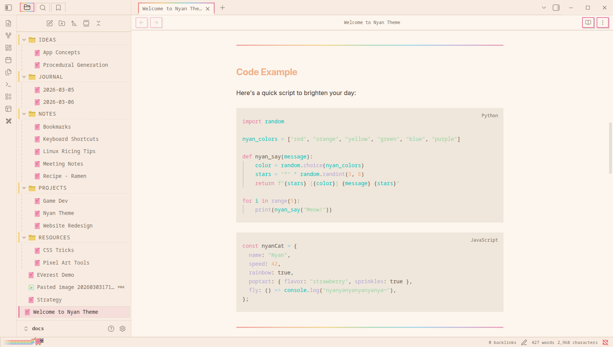

# Nyan Theme for Obsidian

A pixel-retro theme inspired by Nyan Cat. Rainbow headings, pixel-art file icons, animated status bar cat, and a full retro UI overhaul.

## Features

- **Rainbow headings** - each heading level gets a different pastel color
- **Rainbow horizontal rules** - `---` becomes a gradient rainbow
- **Pop-tart checkboxes** - checked boxes turn rainbow
- **Pixel-art file icons** - different icons for `.md`, images, PDFs, audio, video, config files
- **Nyan Cat in status bar** - bouncing pixel-art cat with rainbow trail
- **Twinkling starfield** - animated stars on dark mode background
- **Rainbow loading bar** - animated gradient on the active pane
- **Retro pixel UI** - square corners, chunky borders, drop shadow buttons
- **Silkscreen pixel font** - for UI elements, tabs, sidebar, and headings
- **Light and dark mode** - warm cream tones and deep space navy

## Screenshots

### Dark Mode

### Light Mode

## Installation

### From Obsidian Community Themes
1. Open **Settings** > **Appearance** > **Themes**
2. Click **Manage** and search for **Nyan**
3. Click **Install and use**

### Manual Installation
1. Download `theme.css` and `manifest.json` from the [latest release](https://github.com/kubixservice/obsidian-nyan-theme/releases)
2. Create a folder called `Nyan` in your vault's `.obsidian/themes/` directory
3. Place both files inside
4. Go to **Settings** > **Appearance** > **Themes** and select **Nyan**

## Style Settings

Install the [Style Settings](https://github.com/mgmeyers/obsidian-style-settings) plugin to toggle individual effects:

- Rainbow headings
- Rainbow horizontal rules
- Rainbow scrollbar
- Rainbow active tab indicator
- Pop-tart checkboxes
- Nyan Cat in status bar
- Animated starfield (dark mode)
- Rainbow loading bar
- Sparkle on hover
- Custom accent/background colors
- Font and font size

## Note on Network Usage

This theme loads two pixel fonts from Google Fonts: **Silkscreen** and **Press Start 2P**. This requires an internet connection on first load (fonts are cached by the browser afterward).

## License

[MIT](LICENSE)
